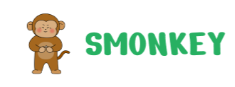

# `배그`팀 해커톤 주제

## 팀명

### 배그

## 제품명

### Smonkey (스몽키)

## 참가 동기

사회적인 문제를 우리의 기술력을 통해서 해결하고자 참가하게 되었습니다.
모두가 사회공헌이라는 공통적인 목표를 모바일 서비스를 통해서 해결하고자 힙니다.

MZ세대의 흡연율은 점점 올라가고 있습니다. 국가지표체계에 따르면 MZ세대의 흡연률은 약 22%정도라고 합니다

고려대학교 가정의학과에 따르면 담배는 3배 유해물질인 타르, 니코인, 일산화탄소 및 기타 발암물일을 포함하여 약 4,000여가지의 독성 화학물질로 구성되어 있다고 합니다. 이 중 니코틴은 중독성을 일으키는 강한 성분이며, 이를 조절하기란 매우 어렵습니다.

이러한 어려가지 문제들을 해결하는 방법은 “금연" 입니다. 금연 서비스는 지금도 상용화되고 있습니다. 하지만 저희 팀이 느끼기에는 MZ세대들을 위한 금연 서비스를 존재하지 않았다고 판단했습니다.

저희는 MZ세대의 특징을 파악해 MZ세대들을 위한 금연 서비스를 만들어 금연을 유도하고자 합니다.

## 주요 기능 및 특징, 기대 효과

스몽키는 여러분의 금연 도우미입니다. 회원가입 단계에서 자신에게 맞는 스몽키 캐릭터를 분양받을 수 있으며, 이 캐릭터를 통해 금연 경험을 새롭고 재미있게 만들어줍니다. 당신이 만든 스몽키 캐릭터는 금연을 잘 이행할수록 건강하게 성장하지만, 담배를 피울 경우 건강이 손상됩니다. 이를 통해 눈에 보이는 변화로 금연의 중요성을 재확인할 수 있습니다.

또한 스몽키는 SNS 기능을 활용해 친구들과 경쟁하고, 서로의 진행 상황을 비교할 수 있게 합니다. 이를 통해 친구들과 함께 도전하는 커뮤니티를 형성하고, 서로 금연을 위해 격려할 수 있습니다.

스몽키는 금연 데이터를 분석하여, 얼마나 오랜 시간 동안 금연을 유지했는지, 금연을 통해 얼마나 많은 돈을 절약했는지를 보여줍니다. 유료 멤버십을 구독하면 이런 정보를 더욱 자세히 확인할 수 있습니다. 이를 통해 담배에 대한 경제적 손실과 금연의 경제적 이익을 직접 확인하며, 더욱 확실한 금연 의지를 갖게 될 것입니다.

사용자가 자신의 스몽키를 커뮤니티의 아바타로 설정하면 금연 커뮤니티에 참여할 수 있습니다. 서로의 이야기를 공유하고, 금연 도전을 격려하는 이 공간에서 새로운 동료를 만날 수 있습니다.

마지막으로, 스몽키는 다양한 금연 캠페인 정보를 제공하며, 스몽키와 협력하는 단체의 캠페인은 앱 상단에 노출되어 쉽게 찾아볼 수 있습니다. 이를 통해 여러분은 다양한 금연 캠페인에 참여하고, 커뮤니티와 함께 성장할 수 있습니다.

## 제품 아키텍처 (이미지)

## 제품 소개 슬라이드

[슬라이드](./decks/smonkey.pdf)

## 제품 소개 동영상

[피그마](https://www.figma.com/proto/7i65sbmulZZHUVWv6EH4Wa/%F0%9F%90%92-HACKERSGROUND?page-id=0%3A1&type=design&node-id=23-5315&viewport=116%2C-644%2C0.09&scaling=contain&starting-point-node-id=23%3A5315&show-proto-sidebar=1&mode=design)
[유튜브](https://www.youtube.com/watch?v=r6m2N6gnihk)
